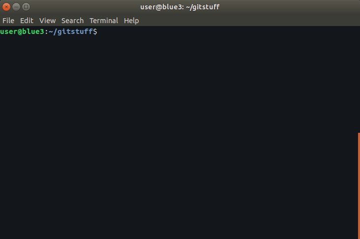

# SheepFarm.sh
[sheepit render farm](https://sheepit-renderfarm.com) cli tools for Linux / MacOSX

SheepFarm Utilities Developed By:  
@howkj1  
https://github.com/howkj1/sheepitfarm

---

## SheepFarm.sh

SheepFarm is a utility script to assist with running the community-driven distributed Blender (https://blender.org) render farm known as SheepIt (https://sheepit-renderfarm.com).

---

### What you will find in SheepFarm.sh
* A guided clui (command line gui) menu system.
* Easy fill forms for updating sheepit client user and key.
* No-hassle quickly download and launch the latest sheepit client.
* "Build" a render farm node by automatically installing the needed dependencies.
* (coming soon...) select CPU or GPU rendering.

---

## Getting Started

_note:_  
This guide assumes you are running a \*nix (Linux/Unix/MacOSX) terminal.

1. Download [sheepfarm.sh](https://github.com/howkj1/sheepitfarm/sheepfarm.sh)
  - `git clone https://github.com/howkj1/sheepitfarm.git`
  - `git clone git@github.com:howkj1/sheepitfarm.git`
  - `wget https://github.com/howkj1/sheepitfarm/sheepfarm.sh -O sheepfarm.sh`
2. Make sure sheepfarm.sh is executable
  - `chmod +x ./sheepfarm.sh`
3. Run the sheepfarm script
  - `./sheepfarm.sh`
  - If prompted, enter your sheepit-renderfarm.com username and client key
  - The username and key is stored locally and will only need to be entered the first time using sheepfarm.sh . 
     -Subsequent runs will re-use these settings until they are changed using the menu options.

---

### System Requirements

* sheepfarm.sh is written in shell scripting language and is fairly portable. However, some/many commands may not behave as expected due to vast differences between shell environments and versions. Please try running sheepfarm.sh from bash >= 4.x.x before filing an issue.

* sheepfarm.sh requirements include those of the SheepIt Render Farm java client.
 - up to date java jre
 - x64 based Intel or AMD CPU (ARM is not yet supported as of May 2019)
 - 4GB or more RAM
 - minimum 2GB or more free disk space

* Recommended System Requirements
 - 8GB+ RAM
 - 4GB+ GPU RAM
 - nVidia CUDA GPU (1050 or 1050 ti)
 - 8GB+ free disk space

---

sheepfarm.sh is verified tested on :
* Ubuntu 18.04
* [bash 4.4.19(1)-release] x86_64-pc-linux-gnu
* nVidia 1050 ti [eVGA 1050 ti SSC]
* Intel Core i7 870 @ 2.93GHz

---

### Disclaimer
While sheepfarm.sh may run perfectly on you machine, it comes with no warranty nor liability. Please test in a non-production environment to see if it suits your needs before deploying.

### License
GPL v.2 in compliance with the official sheepit-client :
https://github.com/laurent-clouet/sheepit-client

---
